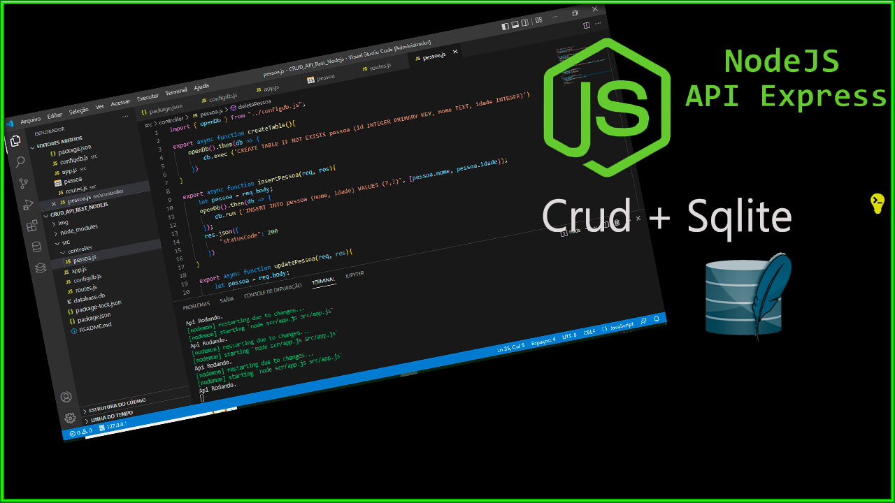
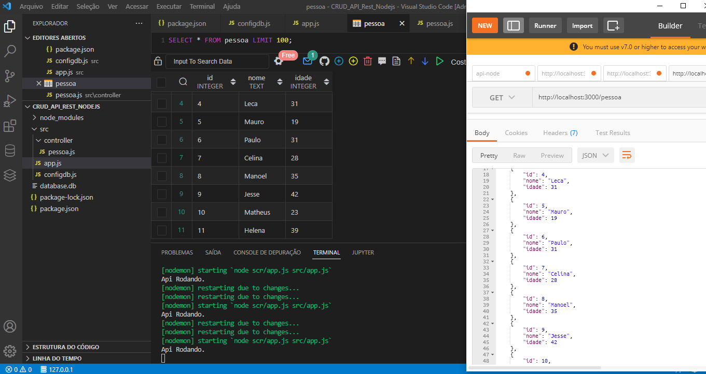
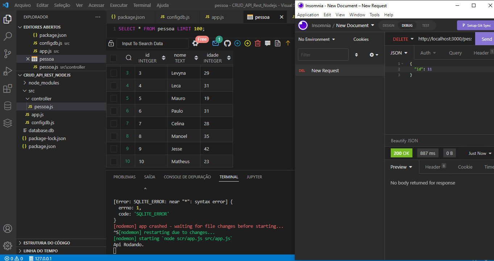
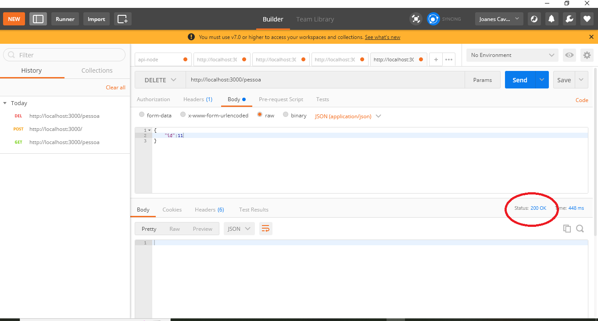
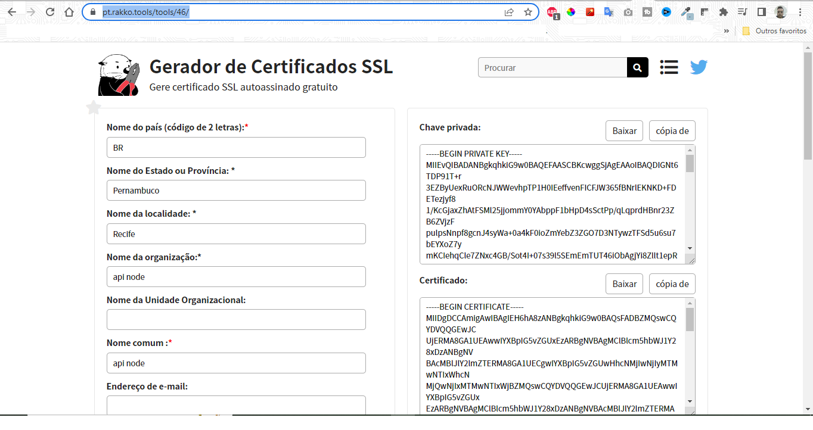

# 👨‍💻️ Criando API Express - Node js + express + Sqlite - Criando API CRUD com Node.

Desenvolvendo uma API usando Node.js , de forma estruturada de fácil manutenção e escalabilidade. Com banco de dados Sqlite, rotas e controlador do objeto **pessoa**.  O famoso CRUD,  utilizando o módulo externo **express**. Utilizamos a biblioteca de **cors** para evitar alguns erros, roteamento do express. Pode ir no site: https://pt.rakko.tools/tools/46/  gerar certificado ssl para aplicar HTTPS em API express.

*Quem quiser brincar com essa API, pode adicionar mais colunas , objetos... e escalando sua API.

 

## TELAS:

GET(Listar):

POST(Inserir):

DELETE(Deletar):

## CERTIFICADO SSL:

*** OBS: SEMPRE POSSO MEXER E VOU ATUALIZANDO AS INFORMAÇÕES ***